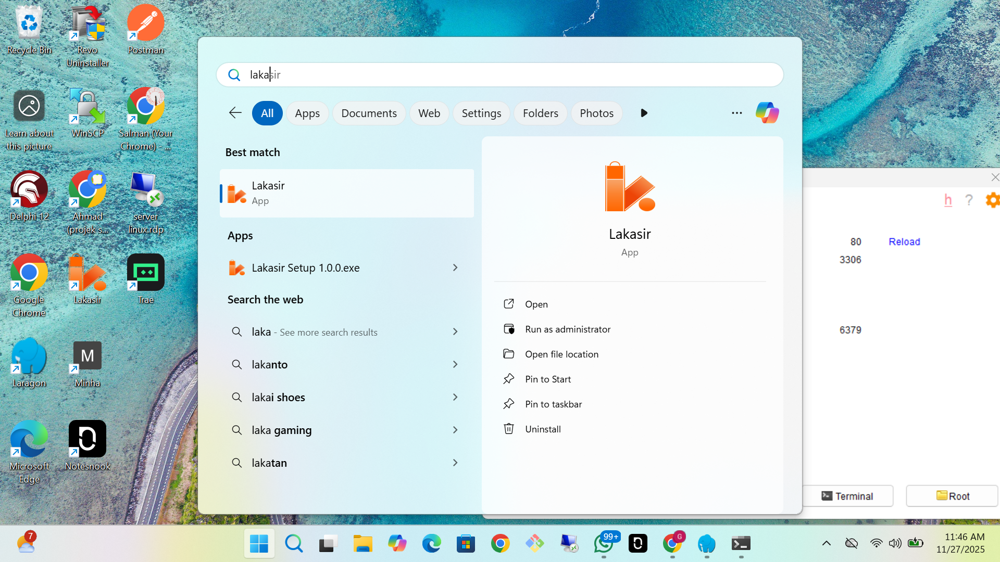
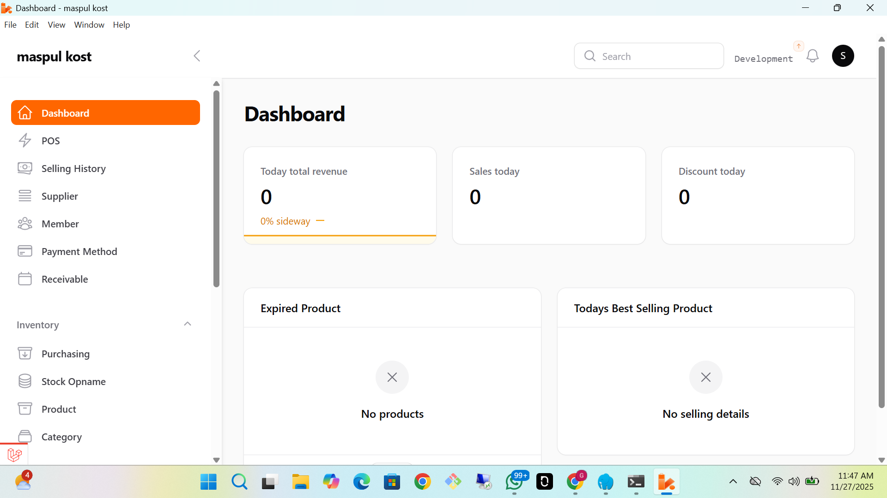
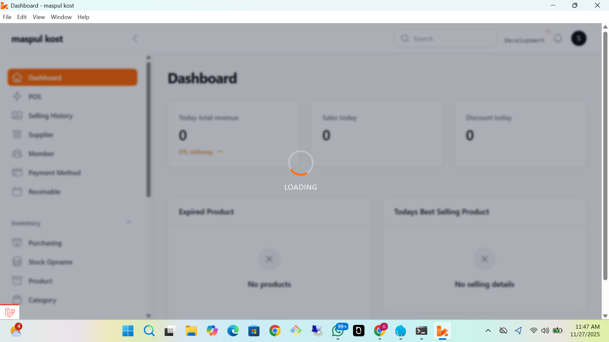

# Lakasir Desktop App

Aplikasi desktop berbasis Electron yang berfungsi sebagai wrapper untuk aplikasi web Laravel Lakasir.

## Deskripsi
Project ini membungkus aplikasi web Lakasir (Laravel) menjadi aplikasi desktop native menggunakan Electron. Aplikasi ini memuat antarmuka web yang berjalan di `http://127.0.0.1:8000`.

## Prasyarat (Prerequisites)
Sebelum menjalankan aplikasi ini, pastikan Anda telah menginstal:
*   [Node.js](https://nodejs.org/) (termasuk npm)
*   Aplikasi Backend Laravel Lakasir yang sudah berjalan di port 8000 (`php artisan serve`)

## Instalasi
1.  Clone repository ini atau download source code.
2.  Buka terminal di direktori project.
3.  Install dependencies menggunakan npm:

```bash
npm install
```

## Cara Menjalankan (Development)
Untuk menjalankan aplikasi dalam mode development:

1.  Pastikan server Laravel sudah berjalan:
    ```bash
    # Di direktori project Laravel
    php artisan serve
    ```
2.  Jalankan aplikasi Electron:
    ```bash
    npm start
    ```

## Build (Produksi)
Untuk membuat installer aplikasi (Windows .exe):

```bash
npm run build
```

Hasil build akan tersedia di folder `dist/`.
Installer akan berformat `.exe` (NSIS installer) untuk arsitektur x64.

## Struktur Project
*   `main.js`: Entry point utama untuk proses Electron. Mengatur pembuatan window dan memuat URL Laravel.
*   `preload.js`: Script preload untuk keamanan dan bridging antara main process dan renderer.
*   `package.json`: Konfigurasi project, dependencies, dan script build.
*   `assets/`: Menyimpan aset statis seperti icon aplikasi.

## Konfigurasi
Konfigurasi utama terdapat di `main.js`. Anda dapat mengubah URL target atau ukuran window default di file ini.

```javascript
// main.js
win.loadURL("http://127.0.0.1:8000"); // URL Backend Laravel
```

## Galeri
Berikut adalah tampilan aplikasi:





saran: 
Tambahkan efek loading pada aplikasi agar pengguna dapat mengetahui bahwa halaman sedang diproses. Saat aplikasi dijalankan dalam bentuk app, indikasi loading tidak selalu terlihat seperti saat dibuka melalui browser. Dengan adanya efek loading, pengalaman pengguna akan lebih jelas dan responsif saat berpindah menu.

